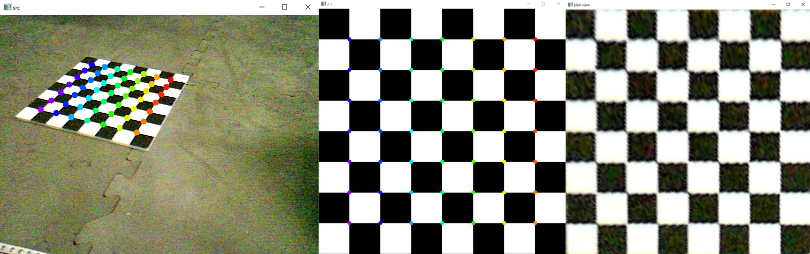

# Homography

## What is homography?

Homography, put simply, is "some math to warp an image."

In our case, we want to take an image from our camera and warp it onto the plane of the field so we can extract coordinates of objects in the real world. This allows us to take pixel coordinates on the image and convert them into real-world coordinates.

More info on how homography works here: [OpenCV Docs](https://docs.opencv.org/4.x/d9/dab/tutorial_homography.html)

## Our process

There are really only two main steps:

1. Calculate the homography matrix.
2. Apply the matrix in real-time to calculate locations of objects.

## Calculating the Homography Matrix

(Snapshot -> Reference Chessboard -> Resulting Transformed Snapshot)

To calibrate/calculate your homography matrix, you need to make sure the camera is mounted on your robot in a way that it will not move around or shift at all, and you need a way to capture images.

You also need a chessboard, ideally one that is solid (flat, no creases, rigid) and with tiles 1 inch × 1 inch. You can print out our [`reference_chessboard.png`](../images/reference/reference_chessboard.png) image on paper and maybe tape/glue it to cardboard, or 3D print our [`printed_chessboard.3mf`](../models/printed_chessboard.3mf) file. We chose to 3D print ours.

If you cannot attain a chessboard with 1 inch × 1 inch tiles, you will just have to apply a scale to the calculated positions.

1. Place the chessboard fully within the camera's frame, near the middle. Make sure the front edge of the chessboard is parallel to the front edge of your robot.
2. Take a picture and download it.
3. Download [`homography_calibration.py`](../src/python/homography_calibration.py), [`homography_test.py`](../src/python/homography_test.py), and [`reference_chessboard.png`](../images/reference/reference_chessboard.png) and put them in the same directory as the image from your camera.
4. Change the filename on line 19 of [`homography_calibration.py`](../src/python/homography_calibration.py) to match the name of the image from your camera.
5. Run the program (`python3 homography_calibration.py`). If errors appear about missing packages, install them with pip (`pip3 install [package-name]`).
6. Press `c` on one of the image windows to have it automatically select all of the chessboard vertices. You can also manually do this by clicking a corresponding location on each image and pressing `s` for each pair.
7. The point dots are colored. Make the locations of the colored dots match between the two images by pressing `r` to rotate them and `f` to flip them.
8. Press `h` to calculate the homography matrix. A transformed image will appear.
9. Copy the calculated matrix out of the terminal/shell output.

If you want to test the matrix, you can copy the Python syntax for the matrix into [`homography_test.py`](../src/python/homography_test.py) (line 5) and the image filename (line 12). Run that program, and test the matrix by clicking on a point on the chessboard on the snapshot. A dot at the corresponding location on the reference image should appear.

## Applying the Matrix

You need to have a pipeline from which you can extract result coordinates. This sample code uses results from a Limelight pipeline, but you can adapt it to fit others.

1. Copy [BasicHomographySample.java](../src/java/BasicHomographySample.java) into your `teamcode` folder.
2. Copy the Java syntax for the matrix into the [BasicHomographySample.java](../src/java/BasicHomographySample.java) on line 25. Change the active pipeline (line 55) if necessary.
3. Upload and run it. Detected results should be printed in Telemetry.
4. The printed coordinates of detected objects will likely be offset. We calibrate the offsets (`HORIZONTAL_OFFSET` and `VERTICAL_OFFSET`) by placing a detected object at a known position, for instance, 24 inches in front of the center of the robot, equivalent to the coordinate (0, 24). Modify the offsets to make the printed coordinate match the expected coordinate.

---

_FIRST Tech Challenge Team 6165 MSET Cuttlefish_
